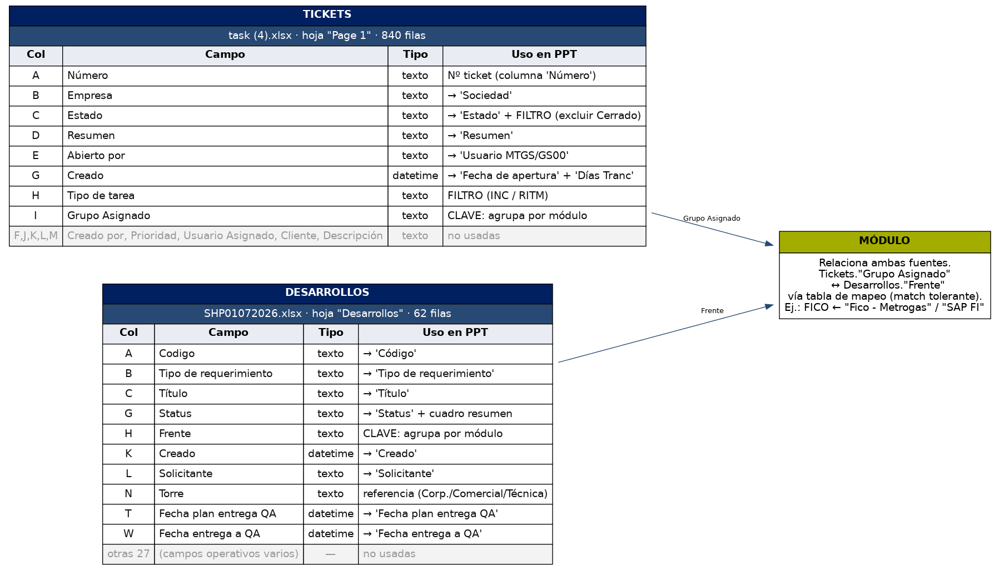
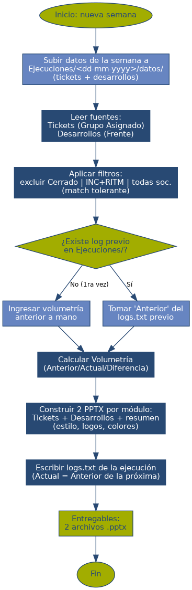
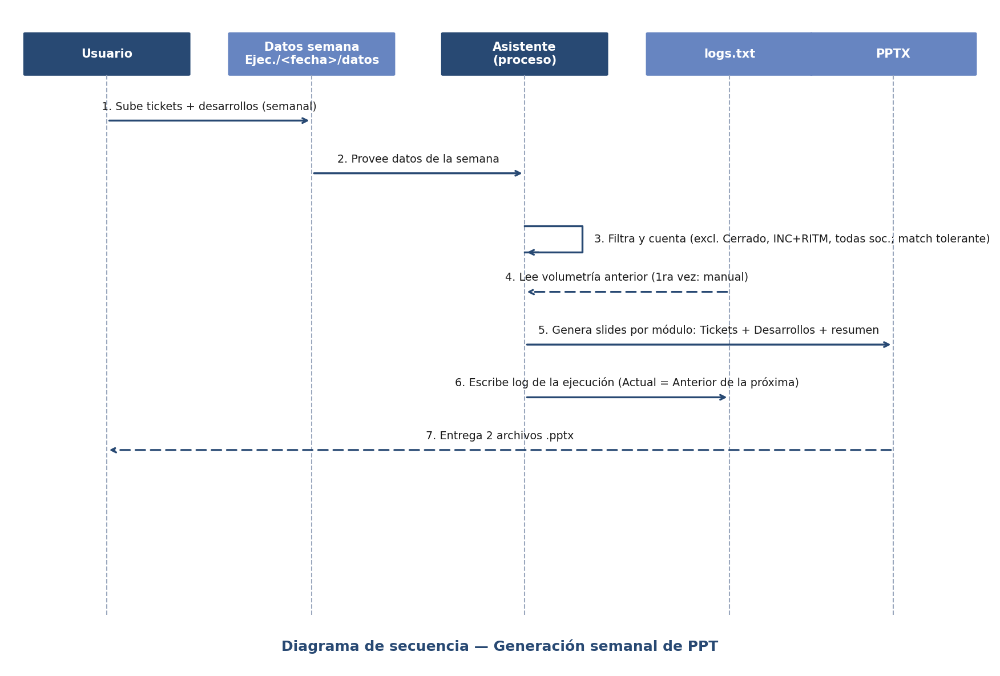

# Resumen del Proyecto — Generación automática de PPT de Seguimiento Operativo

**Última actualización:** 29-07-2026
**Objetivo:** automatizar la generación de dos presentaciones semanales (PowerPoint) a partir de datos de Excel, replicando el formato de las presentaciones modelo.

---

## 1. Qué se está construyendo

Dos presentaciones `.pptx` editables, generadas a partir de datos reales:

1. **Seguimiento Semanal — Torre Comercial y Técnica**
   Módulos: NET, Sharepoint, B&I, FICA, CRM, PM, PS.
2. **Seguimiento Semanal — Torre Corporativa**
   Módulos: HCM, SSFF, R&P, SD, BW, FICO, MM.

Cada presentación tiene: portada, agenda, una slide de Volumetría de Tickets, y por cada módulo una slide de **Tickets** y una de **Desarrollos** (con cuadro resumen por Status), más un cierre con el logo de Metrogas.

---

## 2. Estructura de carpetas y archivos

```
/PPT
├── ESPECIFICACION.md            ← FUENTE DE VERDAD (unifica contexto + requerimiento)
├── RESUMEN_PROYECTO.md          ← este documento (visión general)
├── decisiones_y_pendientes.txt  ← bitácora de decisiones y pendientes
├── modelo-archivos/             ← RECURSOS ESTÁTICOS (fijos)
│   ├── pdf-modelo/               ← las 2 presentaciones modelo (referencia de formato)
│   └── imagenes/                 ← LOGO_metrogas, LOGO_nttdata_azul/blanco, IMG_corporativa
├── Ejecuciones/                 ← corridas REALES (vacía hasta la 1ª real)
│   └── <dd-mm-yyyy>/             ← una carpeta por semana
│       ├── datos/                ← SE SUBE cada semana: tickets + desarrollos
│       └── logs.txt              ← log-resumen de esa ejecución
├── test/                        ← corridas de PRUEBA (misma estructura, NO cuentan como reunión anterior)
│   └── 29-07-2026/              ← ejecución de prueba (datos, logs.txt, 2 .pptx)
├── diagramas/                   ← imágenes de los diagramas (flujo y secuencia)
└── archivos/                    ← referencia histórica (ya no se usan)
    ├── contexto.txt
    └── requerimientoPPT.txt
```

- **`ESPECIFICACION.md`** es la única fuente de verdad: unifica el prompt del equipo
  (`contexto.txt`) y el requerimiento previo (`requerimientoPPT.txt`), que quedan
  solo como referencia histórica.
- **Recursos estáticos** (modelos e imágenes) viven en `modelo-archivos/`.
- **Datos de cada semana** se suben a `Ejecuciones/<dd-mm-yyyy>/datos/`; el proceso
  lee de ahí y deja el `logs.txt` en la misma carpeta.

---

## 3. Fuentes y mapeo por módulo

- **Tickets** → `task (4).xlsx`, columna `Grupo Asignado`.
- **Desarrollos** → `SHP01072026.xlsx`, columna `Frente`.
- El nombre del módulo NO se usa para filtrar; se usa el valor real de la columna.
- El match es **tolerante** a diferencias de mayúsculas/minúsculas, espacios, guiones, el sufijo `- Metrogas` y el prefijo `SAP `, **pero sin confundir tokens distintos** (ej. `Fico` ≠ `Fica`).

| Módulo | Deck | Tickets (Grupo Asignado) | Desarrollos (Frente) |
|---|---|---|---|
| NET | Comercial | `Net - Metrogas` | `Portales y autoatencion` |
| Sharepoint | Comercial | `Sharepoint - Metrogas` | (sin frente → vacío) |
| B&I | Comercial | `B&I - Metrogas` | `SAP ISU` |
| FICA | Comercial | `Fica - Metrogas` | `SAP FICA` |
| CRM | Comercial | `Crm - Metrogas` | `SAP CRM` |
| PM | Comercial | `Pm - Metrogas` | `SAP PM` |
| PS | Comercial | `Ps - Metrogas` | `SAP PS` |
| HCM | Corporativa | `Hcm - Metrogas` | `SAP HCM` |
| SSFF | Corporativa | `Ssff - Metrogas` | (sin frente → vacío) |
| R&P | Corporativa | `R&P - Metrogas` | (sin frente → vacío) |
| SD | Corporativa | `Sd - Metrogas` | `SAP SD` |
| BW | Corporativa | `Bw-Hana - Metrogas` | `BI` |
| FICO | Corporativa | `Fico - Metrogas` | `SAP FI` |
| MM | Corporativa | `Mm - Metrogas` | `SAP MM` |

---

## 4. Decisiones tomadas

**Tabla de Tickets** — columnas: Estado, Sociedad (← `Empresa`), Número, Resumen, Fecha de apertura (← `Creado`), Usuario MTGS/GS00 (← `Abierto por`), Días Tranc (= fecha actual − Creado). Orden: Estado, luego fecha de creación descendente.

**Tabla de Desarrollos** — columnas: Status, Creado, Código, Tipo de requerimiento, Título, Fecha plan entrega QA, Fecha entrega a QA, Solicitante. Más un cuadro resumen inferior con la cantidad por Status.

**Filtros de Tickets:** se incluyen todas las sociedades (solo se filtra por `Grupo Asignado`). Se **excluyen los `Cerrado`** *(provisional)*. Se incluyen ambos tipos, `Incidente` (INC) y `Elemento solicitado` (RITM) *(provisional)*.

**Módulos sin Desarrollos** (Sharepoint, SSFF, R&P): la tabla se muestra solo con la fila de cabecera.

**Volumetría:** comparación Reunión Anterior / Actual / Diferencia. El "Actual" se cuenta del Excel de tickets; el "Anterior" se lee del `logs.txt` de la ejecución previa; la primera vez se ingresa a mano.

**Estilo:** paleta verde `#A2AD00` y azul `#284973` / `#002060` (cabecera de tablas). Logos de Metrogas y NTT DATA e imagen corporativa extraídos de los PDF (carpeta `logos_extraidos/`).

**Correcciones aplicadas al `contexto.txt`:** título de Agenda de la Pres. 2 a "Torre Corporativa"; nombres unificados (`Bw-Hana - Metrogas`, `Fico - Metrogas`, frente `BI`); renumeración de la diapositiva de Desarrollos MM.

---

## 5. Estructura de Ejecuciones y logs

```
/PPT/Ejecuciones/
        └── <dd-mm-yyyy>/
                 └── logs.txt      ← resumen de la ejecución
```

Cada `logs.txt` resume: cabecera, fuentes, parámetros aplicados, volumetría de tickets (anterior/actual/diferencia), resumen de desarrollos por status, observaciones y entregables. Los valores "Actual" de una ejecución son el "Anterior" de la siguiente. Ejemplo generado en `Ejecuciones/29-07-2026/logs.txt`.

---

## 6. Diagramas

**Modelo de datos (esquema de los Excel):**



**Flujo del proceso:**



**Secuencia de interacción semanal:**



---

## 7. Pendientes

1. **[Mañana]** Confirmar el set exacto de estados a excluir en Tickets (¿solo `Cerrado`, o también `Cancelado`/`Resuelto`/`Terminado`?).
2. **[Mañana]** Confirmar Tipo de tarea (¿ambos INC+RITM, o solo Incidente?).
3. No existe `.pptx` modelo (solo PDF): el layout exacto se aproximará desde el PDF.
4. Confirmar si las tipografías **FS EMERIC** y **APTOS NARROW** están instaladas; si no, usar reemplazo (ej. Aptos/Calibri).
5. Validar que las dos fuentes correspondan a la misma reunión (tickets 24-07 vs desarrollos 01-07).

Con los puntos 1 y 2 confirmados, ya se pueden generar los dos `.pptx`.
